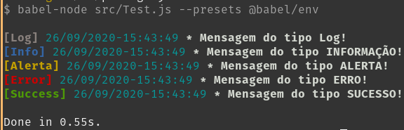

# rc-console

  
[](https://github.com/acelera/rc-console) 
[](https://github.com/acelera/rc-console) 


Utilitário de debug para imprimir mensagens formatadas no console.    
  
## Comece agora:
Instale no seu aplicativo e comece a usar agora:  
  
`yarn add rc-console` ou `npm i rc-console` ou `npm install --save rc-console`  
  
## DOC  
Leia a documentação [AQUI](docs/DOC.md).

## Exemplos  
```js
import Log from 'rc-console';

Log.newLine();
Log.log('Mensagem do tipo Log!');
Log.info('Mensagem do tipo INFORMAÇÃO!');
Log.war('Mensagem do tipo ALERTA!');
Log.err('Mensagem do tipo ERRO!');
Log.ok('Mensagem do tipo SUCESSO!');
Log.newLine();
```  
  

## Contribuindo:
Para clonar o projeto e fazer uma alteração ou nova implementação:  
  
`git clone https://github.com/Acelera/rc-console && cd rc-console`  
`yarn && yarn test`  

Leia o guia de contribuições [AQUI](CONTRIBUTING.md).

## Build e Publicação:
* Para publicar uma nova versão, você precisa alterar no `package.json` a prop `version` de acordo com o SEMVER.
* Depois fazer as alterações necessárias, como um FIX ou ADD, fazer e salvar com um commit atômico vinculado com a issue do github através da #hashtag.
* Gerar a tag da versão que você colocou no `package.json`.

`yarn build && yarn deploy`

## Versionamento

Versionamento [SemVer](http://semver.org/). Para visualizar as versões disponíveis olhe em: [tags on this repository](https://github.com/Acelera/rc-console/tags). 

## Autor

* **Marcus Vinícius Mendes Gonçalves - [@maviniciuus](https://github.com/maviniciuus)** - *Desenvolvimento dos protótipos, versão final e testes.*

## Licença

Esse projeto está licenciado como MIT. Veja mais em [LICENSE.md](LICENSE.md) para detalhes.
